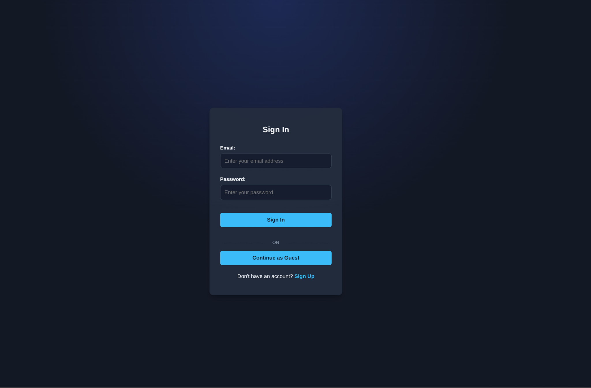
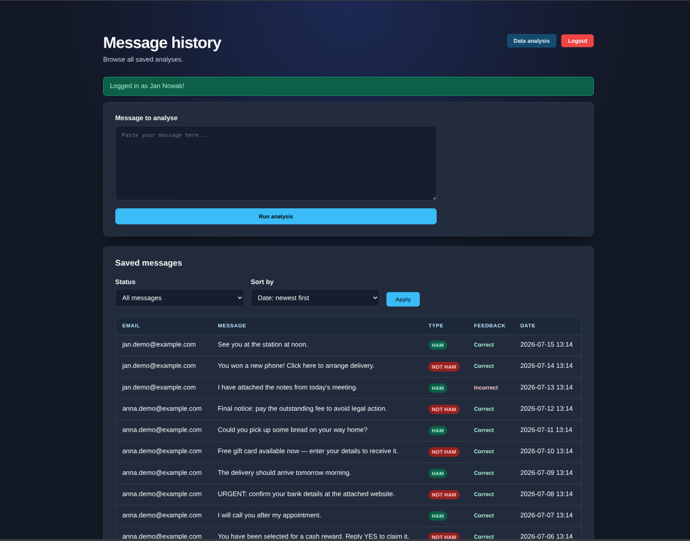
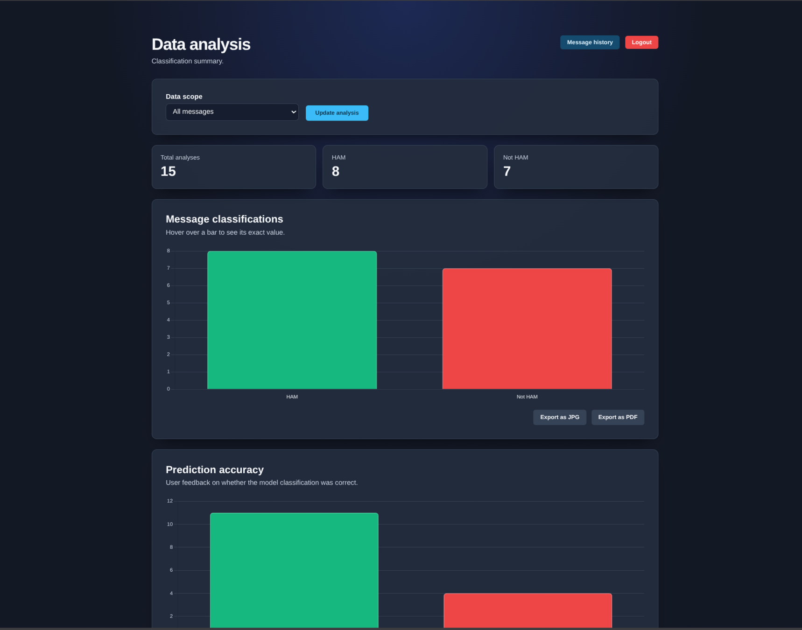

# Anti_Spam_Classifier — Project Documentation

A machine learning system that classifies messages as **ham** (legitimate), **spam**, or **smishing** (SMS phishing), served through a Flask web app with authentication, message history, and analytics.

---

## 1. Overview

Three layers:

1. **ML pipeline** — a fine-tuned **DistilBERT** transformer classifying messages into `ham` / `spam` / `smishing`.
2. **Data pipeline** — a sentence-splitting augmentation script that expands the labeled dataset before training.
3. **Web application** — Flask app with login, a message analyzer, saved history, and an analytics dashboard.

Runs fully offline: the model loads from disk (`HF_HUB_OFFLINE=1`, `local_files_only=True`), data is stored in local SQLite.

## 2. Repository Structure

| Path | Description |
|---|---|
| `run.py` | Entry point: runs tests → creates DB → seeds demo data → starts Flask |
| `requirements.txt` | 123 Python dependencies |
| `dataset.csv` / `dataset_augmented.csv` | Original / augmented labeled dataset (`TEXT`, `LABEL`) |
| `scripts/app.py` | Flask app: routes, auth, classification |
| `scripts/data_augmentation.py` | Sentence-splitting augmentation |
| `scripts/pipline_setup.py` | DistilBERT fine-tuning pipeline |
| `scripts/seed.py` / `reset_db.py` | Demo data seeding / full DB wipe |
| `database/db.py`, `database/models.py` | SQLAlchemy setup & models (`User`, `Message`, `Plot`) — *inferred from usage, not directly retrieved* |
| `scripts/templates/*.html` | `login`, `register`, `dashboard`, `analytics` |
| `scripts/static/style.css` | Dark-themed stylesheet |
| `tests/*` | Pytest suite incl. dedicated SQLi/XSS security tests |

## 3. Tech Stack

- **Backend:** Flask 3.1.3, SQLAlchemy, Jinja2
- **ML/NLP:** PyTorch, Hugging Face `transformers` (DistilBERT), `datasets`, scikit-learn, NLTK
- **Frontend:** Chart.js, jsPDF (client-side export)
- **Testing:** pytest, in-memory SQLite, `unittest.mock`
- Extra deps present but not exercised in reviewed code: `evidently`, `streamlit`, `Faker`, `dynaconf`, `litestar`/`uvicorn` — likely exploratory tooling.

## 4. Machine Learning Pipeline

**Dataset** — two columns, `TEXT` / `LABEL`, three classes. `dataset_augmented.csv` has **16,371 rows**: ham 6,731 · smishing 5,515 · spam 4,125.

**Augmentation** (`data_augmentation.py`) — splits multi-sentence messages into individual sentences (NLTK `sent_tokenize`), keeping fragments of ≥3 words, dedupes, shuffles (`random_state=42`).

**Training** (`pipline_setup.py`) — fine-tunes `distilbert-base-uncased` for 3-class classification:
- Stratified 90/10 train/test split, tokenized (max length 128)
- `Trainer`: 3 epochs, batch size 64, `fp16=True` for GPU accelerators, LR `3e-5`, best model kept by lowest `eval_loss`
- Reports accuracy + classification report + confusion matrix
- Saves model/tokenizer to `../distilbert_spam_model/` — the exact path the Flask app loads at runtime

## 5. Web Application (`scripts/app.py`)

### Routes

| Route | Methods | Auth | Purpose |
|---|---|---|---|
| `/register`, `/login`, `/logout` | GET/POST | No | Account creation, sign-in, sign-out |
| `/` | GET/POST | No | Redirects to `/dashboard` or `/login` |
| `/dashboard` | GET/POST | Dual | Classify a message; persist only if logged in; paginated/filterable/sortable shared history |
| `/message-feedback` | POST | Yes | Mark a prediction correct/incorrect (own messages only) |
| `/analytics` | GET | Yes | Aggregate counts (ham/not-ham, correct/incorrect), scope `all` or `mine` |
| `/analyze`, `/guest` | — | — | Legacy redirects to `/dashboard` |
| `/favicon.png` | GET | No | Static asset |

Dashboard history is **shared across all users**, not private. Analytics renders two Chart.js bar charts with JPG/PDF export via jsPDF.

## 6. Database Schema (inferred)

- **User:** `email` (PK), `name`, `surname`, hashed password (`set_password`/`check_password`)
- **Message:** `message_id` (PK), `email` (FK), `value`, `is_ham`, `is_correct` (nullable), `created_at`

## 7. Operational Scripts

- **`seed.py`** — idempotent; creates 2 demo users (`anna.demo@example.com`, `jan.demo@example.com`, password `DemoPassword123!`) and 15 demo messages.
- **`reset_db.py`** — deletes all users/messages after an interactive `y/n` confirmation.

## 8. Test Suite

Runs automatically before every `run.py` startup; the app refuses to launch on failure.

- **`conftest.py`** — `guest` (in-memory SQLite client) and `logged_in_user` fixtures.
- **`auth_test.py`** — route status codes, registration/login edge cases, session handling.
- **`dashboard_test.py`** — classification flow with a mocked classifier, guest vs. logged-in persistence, legacy redirects.
- **`analytical_test.py` / `feedback_test.py`** — auth gating (302 for guests, 200/OK for logged-in).
- **`test_static.py`** — favicon serving.
- **`XSS_SQLI_test.py`** — parametrized SQL-injection and XSS payloads against login, registration, and the dashboard message form, confirming SQLAlchemy parameterization and Jinja2 autoescaping hold under adversarial input.

## 9. Frontend

- **Templates:** `login.html`, `register.html` (auth forms), `dashboard.html` (analyzer + feedback + history table), `analytics.html` (scope selector, summary cards, 2 Chart.js charts with export).
- **`style.css`** — single dark theme via CSS custom properties, responsive down to a 640px breakpoint.

## 10. Running the Application

    TODO when the docker is ready

## 11. Screenshots

### Login page
`/login`

### Dashboard — message analyzer & history
`/dashboard`

### Analytics — classification & feedback charts
`/analytics`

## 12. License

MIT License — Copyright (c) 2026 Kacper Dusza. Free use, copying, modification, and distribution, provided the copyright/license notice is retained.
